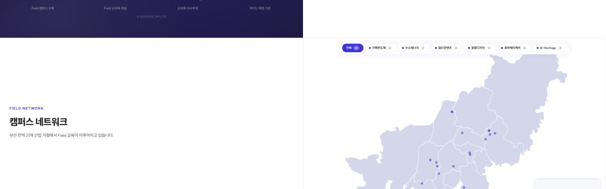

# 글로컬 연합대학 스크롤 인터랙션 전략

> 작성일: 2026-03-24
> 대상: https://dev-five-git.github.io/donga-dongseo-glocal/

---

## 페이지별 전략

### 1. 메인 (`/`)

- 푸터 제외 전체 섹션 스냅

### 2. Innovation (`/innovation`)

- 푸터 제외 섹션 스냅
- 8대 추진과제: 2단 스냅 (타이틀에 먼저 스냅 → 다음 스크롤에 카드가 한 장씩 가로 전환)
- 모바일 가로 스냅 처리 방식 추천 필요

> **2단 스냅 예시** (sub_page_35 캠퍼스 네트워크 구현): 휠 한 번에 타이틀(좌)에 고정, 한 번 더 굴리면 지도(우)로 이동.
>
> 

### 3. IACF 통합산단 (`/iacf`)

- 푸터, 추진성과(ACHIEVEMENT) 제외 섹션 스냅
- 모바일 스크롤 시안 필요
- 히어로 SCROLL DOWN 여백을 혁신방향 페이지와 동일하게 조정
- 3개 원형 모션(BM 진입): 순차 딜레이로 순서감 표현
- 3대 수익모델: 모바일 가로 스크롤 스냅 (한 카드씩)
- 3대 추진전략: 가로 스크롤 스냅만 적용
- VISION VIDEO: 스크롤 시 전체 화면 전환 모션

### 4. Field Campus (`/field-campus`)

- 인트로 배너, ABOUT, EDUCATION에 섹션 스냅
- 6개 연합전공, JA교원은 자유 스크롤
- 하단에 구축현황 유도 CTA 추가 (소개 → 구축현황, 단방향)

> **CTA**: "부산 전역이 캠퍼스입니다 — 21개 산업 거점에서 실무 중심 교육이 이루어지고 있습니다" + [거점 지도 보기 →] [연합전공 소개 보기 →]
>
> 

### 5. Field Campus Status (`/field-campus/status`)

- 배너, 성과에 섹션 스냅
- 캠퍼스 네트워크: 2단 스냅 (타이틀 → 지도 전체 화면)
- 21개 거점 카드는 자유 스크롤
- 대표 Field 캠퍼스 4카드: 스크롤에 따라 순차 노출

### 6. Major 연합전공 (`/major`)

- 장학금 숫자에 CountUp 애니메이션 추가

### 7. Major/Curriculum 교과과정표 (`/major/curriculum`)

- 각 전공 시작점에 섹션 스냅
- 전공 내부는 자유 스크롤

---

## 전체 요약

| 페이지 | 섹션 스냅 | 가로 스크롤 스냅 | 2단 스냅 | 기타 |
|--------|:---:|:---:|:---:|------|
| `/` 메인 | 전체 (푸터 제외) | — | — | — |
| `/innovation` | 전체 (푸터 제외) | 8대 추진과제 | 8대 추진과제 (타이틀→카드) | 모바일 가로 스냅 추천 필요 |
| `/iacf` | 전체 (푸터, 추진성과 제외) | 3대 수익모델(모바일), 3대 전략 | — | VIDEO 전체화면 모션, BM 원형 딜레이 |
| `/field-campus` | 인트로, ABOUT, EDUCATION | — | — | 구축현황 CTA 추가 |
| `/field-campus/status` | 배너, 성과 | — | 지도 (타이틀→지도) | 대표 캠퍼스 4카드 순차 노출 |
| `/major` | — | — | — | 장학금 CountUp |
| `/major/curriculum` | 전공 시작점 | — | — | — |
