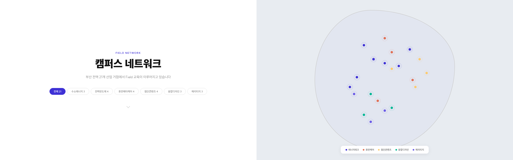

# 글로컬 연합대학 스크롤 인터랙션 전략

> 작성일: 2026-03-23
> 대상: https://dev-five-git.github.io/donga-dongseo-glocal/

---

## 페이지별 전략

### 1. 메인 (`/`)

푸터 제외 전체 섹션 스냅.

### 2. Innovation (`/innovation`)

푸터 제외 섹션 스냅. 8대 추진과제 영역은 2단 스냅 — 섹션 진입 시 타이틀에 먼저 스냅되고, 이후 스크롤하면 카드가 한 장씩 가로 스크롤 스냅으로 전환. 모바일에서의 가로 스냅 처리 방식은 추천 필요.

> **2단 스냅 예시**: 타이틀이 먼저 전체 화면으로 보이고, 다음 스크롤에 본체(카드/지도 등)가 전체 화면으로 전환되는 방식.
>
> 

### 3. IACF 통합산단 (`/iacf`)

푸터, 추진성과(ACHIEVEMENT) 제외 섹션 스냅. 현재 모바일에서 스크롤 시안이 없으므로 모바일 대응 필요.

- 히어로 SCROLL DOWN 버튼 여백을 혁신방향(innovation) 페이지와 동일하게 조정 필요
- 초기 3개 원형 모션(BM 진입 시)이 너무 동시에 나옴 — 순차적으로 딜레이를 줘서 순서감을 표현할 것
- 3대 수익모델(3 BM): 모바일에서 가로 스크롤 스냅 (한 카드씩)
- 3대 추진전략: Innovation 8대 과제와 같은 2단 스냅 방식 (타이틀 스냅 → 가로 스크롤 스냅)
- VISION VIDEO: 랜딩페이지와 같이 스크롤 시 전체 화면으로 전환되는 모션 필요

### 4. Field Campus (`/field-campus`)

인트로 배너, ABOUT, EDUCATION에 섹션 스냅. 6개 연합전공, JA교원은 자유 스크롤. 페이지 하단에 구축현황(`/field-campus/status`)으로 유도하는 CTA 필요 — sub_page_35의 대표 캠퍼스 이미지를 캡처하여 프리뷰로 노출.

### 5. Field Campus Status (`/field-campus/status`)

배너, 성과에 섹션 스냅. 캠퍼스 네트워크는 2단 스냅 — 첫 스냅에 타이틀과 필터, 다음 스냅에 지도가 전체 화면으로 표시. 21개 거점 카드는 자유 스크롤. 대표 Field 캠퍼스 4개 카드는 스크롤에 따라 한 장씩 순차 노출.

### 6. Major 연합전공 (`/major`)

장학금 숫자에 CountUp 애니메이션 추가.

### 7. Major/Curriculum 교과과정표 (`/major/curriculum`)

각 전공 시작점에 섹션 스냅 적용. 전공별 콘텐츠가 한 화면을 넘지만 시작점에만 스냅이 걸리므로 내부는 자유 스크롤.

---

## 전체 요약

| 페이지 | 섹션 스냅 | 가로 스크롤 스냅 | 2단 스냅 | 기타 |
|--------|:---:|:---:|:---:|------|
| `/` 메인 | 전체 (푸터 제외) | — | — | — |
| `/innovation` | 전체 (푸터 제외) | 8대 추진과제 | 8대 추진과제 (타이틀→카드) | 모바일 가로 스냅 추천 필요 |
| `/iacf` | 전체 (푸터, 추진성과 제외) | 3대 수익모델(모바일), 3대 전략 | 3대 전략 (타이틀→카드) | VIDEO 전체화면 모션, BM 원형 딜레이 |
| `/field-campus` | 인트로, ABOUT, EDUCATION | — | — | 구축현황 CTA 추가 |
| `/field-campus/status` | 배너, 성과 | — | 지도 (타이틀→지도 풀) | 대표 캠퍼스 4카드 순차 노출 |
| `/major` | — | — | — | 장학금 CountUp |
| `/major/curriculum` | 전공 시작점 | — | — | — |
