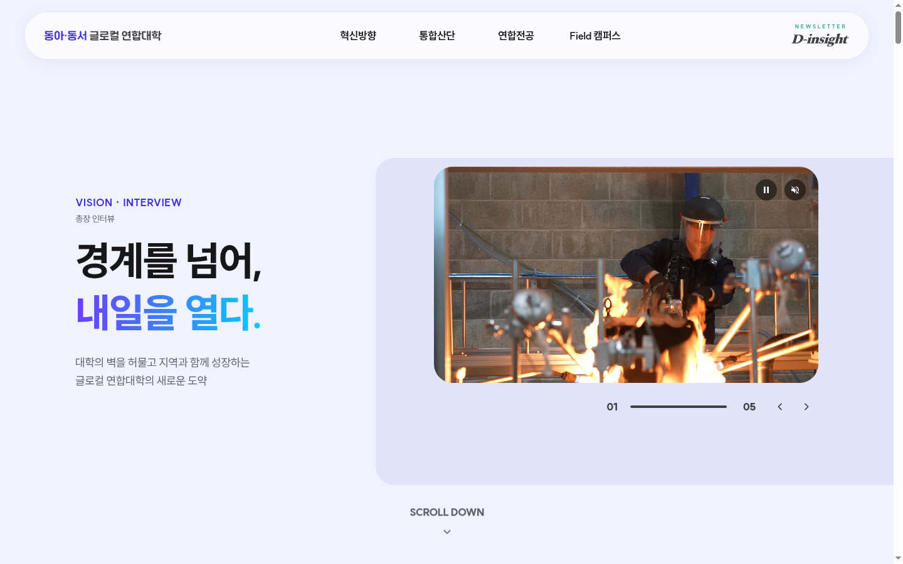
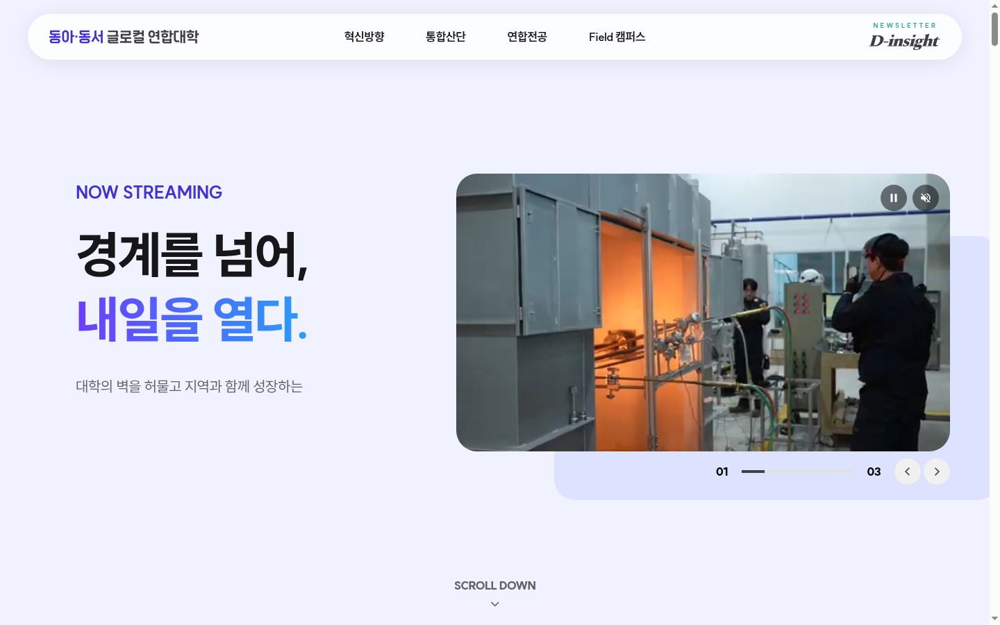
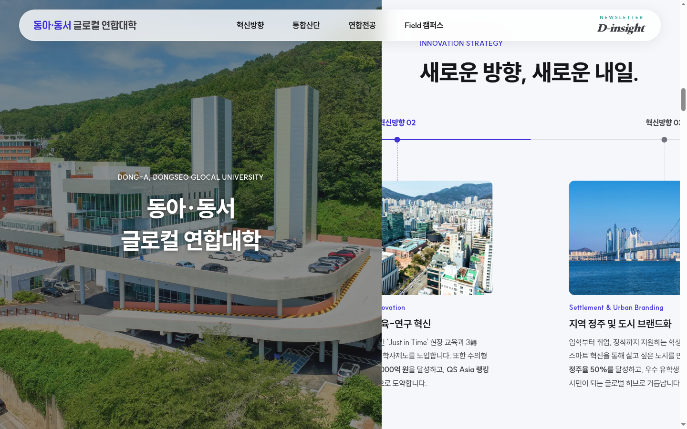
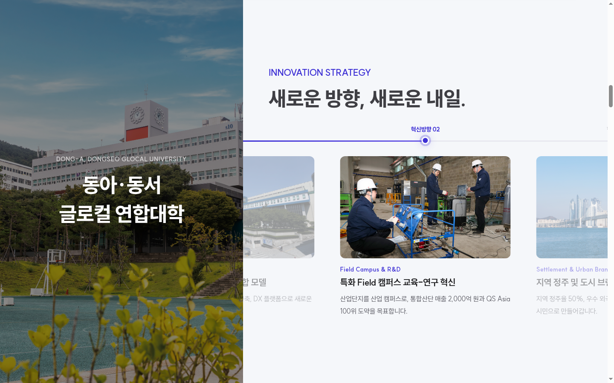
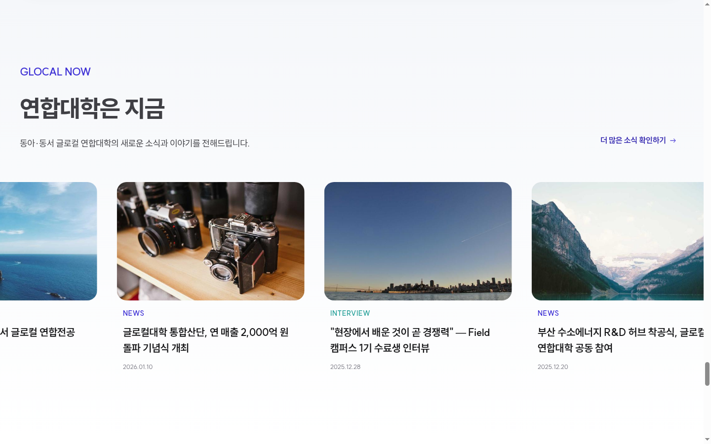
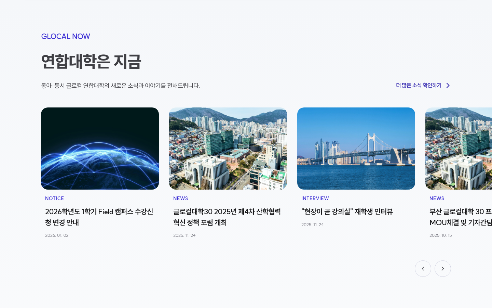

# 랜딩페이지 검토 — 개발버전(DevFive) & 수정제안버전 비교

**작성일**: 2026.03.03
**개발버전(DevFive)**: https://dev-five-git.github.io/donga-dongseo-glocal/
**수정제안**: https://dhkim13dongaackr.github.io/glocal-web/landing_20260223/

> DevFive에서 작업해 주신 개발버전을 기반으로, 저희 쪽에서 몇 가지 보완 방향을 정리했습니다.
> 수정제안버전에 미리 반영해 둔 부분도 있으니 참고부탁드립니다.

---

## 1. 헤더 / 내비게이션

### 1-1. 글라스모피즘 적용

헤더에 글라스모피즘을 적용했습니다. (반투명 배경 `rgba(255,255,255,0.72)` + `backdrop-filter: blur(24px) saturate(180%)`).

### 1-2. 메뉴 호버 시 드롭다운 처리

개발버전에서 메뉴를 호버하면 서브메뉴가 펼쳐지면서 메뉴 영역이 커지는데, 이 부분에 

- **서브메뉴 폰트 크기 축소**: 수정제안버전에서는 대메뉴 17px / 서브메뉴 14px로 설정하여 드롭다운이 열려도 대메뉴 위치가 밀리지 않도록 했습니다
- **메뉴 호버 효과**: 호버 시 연보라 캡슐 배경(`#f0eeff`)으로 부드럽게 강조하는 방식을 적용했습니다 (이미 적용완료)

### 1-3. 서브메뉴명 일부 변경

서브메뉴 폰트 축소에 맞춰, 글자 수가 긴 항목을 간결하게 조정했습니다.

| 대메뉴 | 개발버전(DevFive) | 수정제안버전 |
|--------|-----------------|------------|
| 통합산단 | 지향점 및 혁신 성과 | **추진전략** |
|         | 기술사업화 플랫폼 | **통합기술플랫폼** |

그 외 메뉴(혁신방향, 연합전공, Field 캠퍼스)의 서브메뉴는 동일합니다.

### 1-4. "동아·동서 글로컬 연합대학" 로고 크기

개발버전에서는 헤더 로고 텍스트가 다소 크게 느껴집니다. 조금 줄여 주시면 헤더 좋아질 것 같습니다.

### 1-5. D-insight 상단 문구 변경

현재 개발버전에서 D-insight 아이콘 상단에 "NEWSLETTER"라고 표기되어 있는데, **"GLOCAL WEBZINE"**으로 변경 부탁드립니다.

---

## 2. 히어로(타이틀) 섹션

### 2-1. 슬라이드별 문구 구성

현재 개발버전에서도 영상 전환 시 타이틀·서브카피가 바뀌고 있는데 조금 더 수정 부탁드립니다.

#### 슬라이드별 비교

| # | 전공 | 항목 | 개발버전(DevFive) | 수정제안 |
|---|------|------|-----------------|------------|
| 1 | 총장 인터뷰 | 카테고리 | NOW STREAMING | VISION · INTERVIEW |
|   |            | 서브라벨 | *(없음)* | 총장 인터뷰 |
|   |            | 타이틀 | 경계를 넘어, 내일을 열다. | 경계를 넘어, 내일을 열다. |
|   |            | 서브카피 | 대학의 벽을 허물고 지역과 함께 성장하는 | 대학의 벽을 허물고 지역과 함께 성장하는 **글로컬 연합대학의 새로운 도약** |
| 2 | 수소에너지 | 카테고리 | NOW STREAMING | FIELD · HYDROGEN |
|   |           | 서브라벨 | *(없음)* | 수소에너지전공 |
|   |           | 타이틀 | 가장 가벼운 원소, 세상을 움직이다. | 가장 가벼운 원소, 세상을 움직이다. |
|   |           | 서브카피 | 수소에너지 생산·저장·활용 전 주기를 현장에서 | 수소에너지 생산·저장·활용 전 주기를 현장에서 **배우는 차세대 에너지 특화 전공** |
| 3 | 전력반도체 | 카테고리 | NOW STREAMING | FIELD · SEMICONDUCTOR |
|   |           | 서브라벨 | *(없음)* | 전력반도체전공 |
|   |           | 타이틀 | SiC와 GaN, 한계에 도전하다. | SiC와 GaN, 한계에 도전하다. |
|   |           | 서브카피 | 전력반도체 설계부터 공정까지 | 전력반도체 설계부터 공정까지 **현장 중심 교육과 연구의 최전선** |
| 4 | 첨단콘텐츠 | 카테고리 | *(슬라이드 없음)* | FIELD · CONTENTS |
|   |           | 서브라벨 | — | 첨단콘텐츠전공 |
|   |           | 타이틀 | — | 또 하나의 세상, 눈앞에 펼치다. |
|   |           | 서브카피 | — | BIFF 연계 XR·VR, AI 서사창작까지 **엔터테인먼트 엔지니어링의 새 지평** |
| 5 | AI융합디자인 | 카테고리 | *(슬라이드 없음)* | FIELD · DESIGN |
|   |             | 서브라벨 | — | AI융합디자인전공 |
|   |             | 타이틀 | — | 알고리즘이 입히는, 새로운 경험. |
|   |             | 서브카피 | — | AI-UX부터 미래 라이프스타일 디자인까지 **데이터와 감각이 만나는 융합 디자인 전공** |

#### 주요 제안 사항

| 항목 | 개발버전 현황 | 제안 |
|------|------------|------|
| 상단 카테고리 | "NOW STREAMING" 고정 | 슬라이드별 전공 영문명 반영 (FIELD · HYDROGEN 등) |
| 서브라벨 | 미표기 | 한글 전공명 노출 (수소에너지전공 등) |
| 서브카피 | 1줄 구성 | 2줄로 확장하여 전공 특색 전달 |
| 슬라이드 수 | 3개 (총장/수소/전력) | 5개로 확장 (첨단콘텐츠·AI융합디자인 추가) |

**수정제안버전**

**개발버전(DevFive)**

---

## 3. 혁신방향(INNOVATION STRATEGY) 인터랙션

이 구간에서 각 혁신방향을 하나씩 충분히 볼 수 있도록, 수정제안버전에 몇 가지 인터랙션을 적용해 봤습니다.

### 3-1. 왼쪽 캠퍼스 이미지 전환

수정제안버전에서는 혁신방향이 바뀔 때마다 왼쪽 배경 이미지가 해당 캠퍼스 사진으로 크로스페이드 됩니다.

| 혁신방향 | 배경 이미지 |
|---------|-----------|
| 01 — Field Campus & R&D Innovation | [동서대 주례캠퍼스](https://dhkim13dongaackr.github.io/glocal-web/static/pictures/동서대주례.jpg) |
| 02 — Settlement & Urban Boarding | [동아대 승학캠퍼스](https://dhkim13dongaackr.github.io/glocal-web/static/pictures/동아대승학.jpg) |
| 03 — The Open Alliance University | [동아대 부민캠퍼스](https://dhkim13dongaackr.github.io/glocal-web/static/pictures/동아대부민.jpg) |
| 지향점 — Connected Campus Ecosystem | [동서대 센텀캠퍼스](https://dhkim13dongaackr.github.io/glocal-web/static/pictures/동서대센텀.jpg) |

개발버전에서는 왼쪽 이미지가 고정되어 있는데, 카드 전환에 맞춰 배경도 함께 바뀌면 각 방향의 특성이 더 잘 전달될 것 같습니다.

### 3-2. 스크롤 스냅 & 중앙 고정

수정제안버전에서 적용한 방식입니다:

1. **섹션 진입 시 고정(Sticky)** — 혁신방향 영역에 도달하면 화면에 고정
2. **카드별 스냅** — 스크롤 시 카드가 항상 화면 중앙에 정렬, 카드 사이 어중간한 위치에서 멈추지 않게 수정
3. **타임라인 진행** — 상단 도트가 현재 활성 카드를 표시하고, 진행선이 채워짐
4. **도트 클릭 이동** — 상단 도트를 클릭하면 해당 카드로 바로 이동

현재 개발버전에서는 스크롤 시 자연스럽게 지나가고 있어서, 스냅/고정을 적용하면 각 콘텐츠를 충분히 읽을 수 있는 시간을 확보할 수 있습니다.

### 3-3. 인디케이터 펄스 & 비활성 카드

- 활성 구간의 인디케이터(원형 포인트)에 은은한 펄스 효과를 넣으면 좋겠습니다
- 비활성(이전/다음) 카드를 반투명 처리하여 활성 카드에 시선이 집중되도록 하면 좋겠습니다

**개발버전(DevFive)**

**수정제안**

---

## 4. FIELD CAMPUS — 카테고리 버튼 순서

### 4-1. 버튼순서

버튼 순서를 아래와 같이 맞춰 주시면 좋겠습니다.

| 구분 | 버튼 순서 |
|------|----------|
| **요청 순서** | 전체 → 전력반도체 → 수소에너지 → 첨단콘텐츠 → 융합디자인 → 휴먼메타케어 → B-Heritage |
| **개발버전(DevFive)** | B-헤리티지 → 융합디자인 → 휴먼메타케어 → 수소에너지 → 첨단콘텐츠 → 전력반도체 |

- "전체" 보기 버튼도 가능할지 검토 부탁드립니다.

### 4-2. 스크롤 반응 속도

카드 이동 속도가 다소 느려서 스크롤 시 답답한 느낌이 있습니다. 감도와 속도를 조금 높여 주시면 더 쾌적할 것 같습니다.

- 그 외 지도 영역·전체 레이아웃은 새로운 시안이 나오면 함께 논의하면 좋겠습니다

---

## 5. 성과 수치 (CORE ACHIEVEMENTS)

### 5-1. 숫자 + 단위 붙여쓰기

| 현재 (개발버전) | 제안 |
|---------------|------|
| `연합전공 수강생 15,000+ 명` | `연합전공 참여학생 2,363명` |
| `통합산단 매출액 2,000억+ 원` | `통합산단 매출액 918억 원` |
| `외국인 유학생 유치 7,000+ 명` | `외국인 유학생 유치 3,898명` |

### 5-2. 카운트업 애니메이션

구간을 벗어났다가 다시 들어오면 카운트업 애니메이션이 반복재생 되도록 수정 부탁드립니다

---

## 6. GLOCAL NOW

### 6-1. 레이아웃 — 타이틀 제한, 카드는 화면 끝까지

수정제안버전에서는 타이틀 영역은 content-w(1280px) 기준으로 좌측 정렬하되, 카드 영역은 오른쪽 화면 끝까지 확장되는 레이아웃을 적용했습니다.
개발버전에서도 이 방향을 검토해 주시면 좋겠습니다.

### 6-2. 스크롤 반응 속도

카드 이동 속도가 다소 느려서 스크롤 시 답답한 느낌이 있습니다. 감도와 속도를 조금 높여 주시면 더 쾌적할 것 같습니다.

**개발버전(DevFive)**

**수정제안버전**

