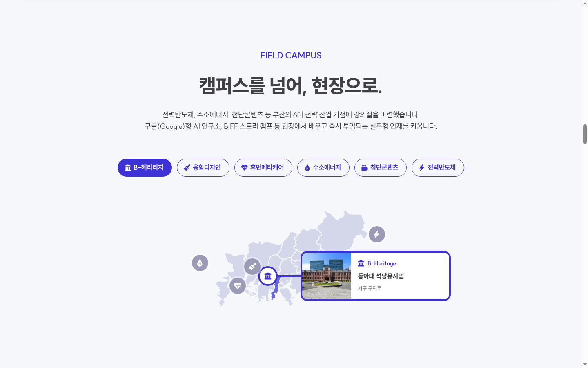
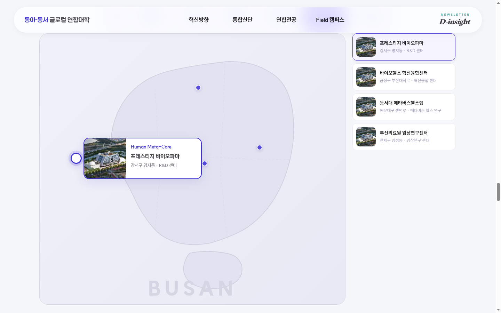
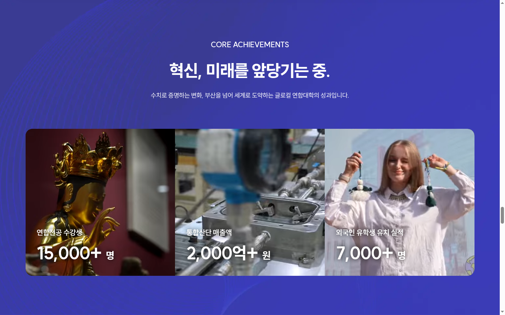
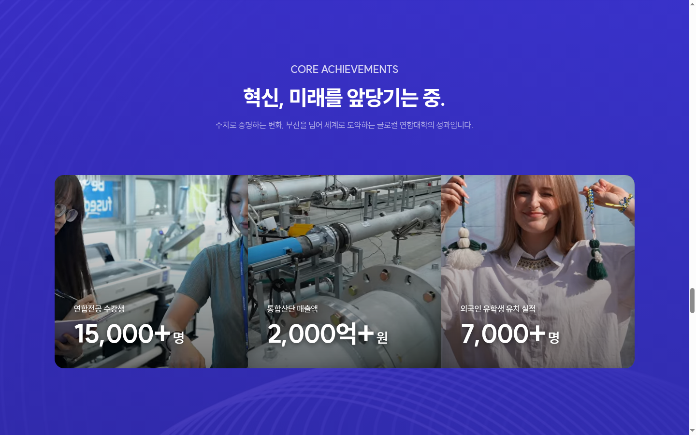

# 랜딩페이지 피드백 — 업체 제작본 vs 기획안 비교

**피드백 작성일**: 2026.03.03
**업체 제작 URL**: https://dev-five-git.github.io/donga-dongseo-glocal/
**우리 구현본 기준**: `landing_20260223/index.html`

> 아래 내용은 `landing_20260223` 기준 우리 구현본과 업체 제작 페이지(https://dev-five-git.github.io/donga-dongseo-glocal/) 간의 차이점을 기술한 것입니다.

---

## 1. 랜딩페이지 타이틀(히어로) 섹션

### 1-1. 타이틀 그라데이션 색상 차이

기획안에서 요청한 그라데이션 컬러톤과 업체 제작 페이지의 컬러톤이 상이합니다.
기존 시안의 컬러감(블루-퍼플 계열의 명도/채도 기준)에 맞춰 조정이 필요합니다.

| 구분 | 현황 |
|------|------|
| **우리 구현본** | `linear-gradient(90deg, #6b3eff, #0acaff)` — 진한 퍼플-시안 |
| **업체 제작본** | 블루-퍼플 계열이나 명도/채도가 다소 상이 |

**우리 구현본 (히어로)**

**업체 제작본 (히어로)**

### 1-2. 상단 문구("NOW STREAMING") 고정 노출 문제

- **업체 제작본**: 상단의 "NOW STREAMING" 문구가 고정되어 있음
- **우리 구현본**: "VISION · INTERVIEW" 등 영상 전환에 따라 카테고리 문구가 동적으로 변경되도록 구현
- **기획 의도**: 각 영상(콘텐츠) 전환에 따라 타이틀 및 상단 카테고리 문구가 함께 변경되어야 함
- **수정 필요**: 업체 제작본에서 영상 전환 시 상단 카테고리 문구도 동적으로 변경되도록 수정 필요

---

## 2. 혁신방향(INNOVATION STRATEGY) 구간 인터랙션

### 2-1. 인디케이터(포인트) 애니메이션 미적용

- **기획 의도**: 상단 진행 인디케이터(원형 포인트)에 깜박이는(펄스) 애니메이션 효과 적용
- **업체 제작본 현황**: 해당 애니메이션 효과 미적용
- **수정 필요**: 활성 구간임을 직관적으로 인지할 수 있도록 펄스(깜박임) 효과 적용 필요

**업체 제작본 (혁신방향 인디케이터)**

**우리 구현본 (혁신방향)**

### 2-2. 스크롤 시 중앙 고정(스냅) 효과 미반영

- **기획 의도**: 사용자가 스크롤 시 해당 구간이 화면 중앙에 고정되며 멈추는 구조 (Scroll Snap 또는 Section Pinning)
- **업체 제작본 현황**: 별도의 고정 없이 자연스럽게 스크롤되어 지나감
- **수정 필요**: 콘텐츠 집중도 및 구간 전환 강조를 위해 해당 섹션이 중앙에 위치하도록 스크롤 스냅 기능 적용 필요

### 2-3. 비활성 카드 시각적 구분 미반영

- **기획 의도**: 선택되지 않은(이전/다음) 혁신방향 카드를 반투명 처리하여 비활성 상태로 표현
- **업체 제작본 현황**: 활성/비활성 카드 간 시각적 차이가 명확하지 않음
- **수정 필요**: 비활성 카드는 반투명 처리 등 시각적 구분 요소 적용 필요

---

## 3. FIELD CAMPUS 섹션

### 3-1. 카테고리 버튼 구성 순서 변경

| 구분 | 버튼 순서 |
|------|----------|
| **기획 요청** | 전체 → 전력반도체 → 수소에너지 → 첨단콘텐츠 → 융합디자인 → 휴먼메타케어 → B-Heritage |
| **업체 제작본** | B-헤리티지 → 융합디자인 → 휴먼메타케어 → 수소에너지 → 첨단콘텐츠 → 전력반도체 |
| **우리 구현본** | 전체 → 전력반도체 → 수소에너지 → 첨단콘텐츠 → 융합디자인 → 휴먼메타케어 → B-Heritage |

- 업체 제작본의 버튼 순서가 기획안과 상이하며, **"전체" 보기 기능이 누락**됨
- 우리 구현본은 기획 요청 순서에 맞게 구현 완료

**업체 제작본 (필드캠퍼스 버튼)**

**우리 구현본 (필드캠퍼스 버튼)**

> **참고**: 지도 영역은 업체 시안 검토 후 별도 논의 예정

---

## 4. 성과 수치 표기 방식 (CORE ACHIEVEMENTS)

### 4-1. '+' 기호와 단위 사이 띄어쓰기 문제

- **현재 업체 제작본**: `15,000+ 명`, `2,000억+ 원`, `7,000+ 명` — '+' 기호 뒤 단위가 띄어쓰기 되어 표기됨
- **기획 요청**: 성과 수치는 하나의 강조 값으로 인식되도록 '+'와 단위를 붙여 표기
- **수정 방향**: `15,000+명`, `2,000억+원`, `7,000+명`

**업체 제작본 (성과 수치)**

**우리 구현본 (성과 수치)**

---

## 5. GLOCAL NOW 영역 인터랙션

### 5-1. 세로 스크롤 기반 가로 카드 이동 속도 이슈

- 현재 업체 제작본은 세로 스크롤에 따라 가로 카드가 이동하는 구조
- 카드 이동 속도가 느려 스크롤 반응성이 떨어지고 다소 답답한 느낌
- **수정 필요**: 스크롤 감도 및 애니메이션 속도 조정 → 즉각적으로 반응하는 자연스러운 인터랙션 구현 필요

### 5-2. 슬라이드 좌우 조작 버튼 미반영

- 우측 하단에 좌우 이동 버튼(`<` `>`)이 미반영
- **수정 필요**: 좌우 이동 버튼 추가

### 5-3. 레이아웃 정렬 불일치

- **기획안 기준**: 타이틀 영역과 카드 이미지 영역의 좌측 시작선이 동일한 그리드 기준으로 정렬
- **업체 제작본**: 타이틀과 카드 영역의 좌측 정렬선이 일치하지 않음
- **수정 필요**: 레이아웃 일관성 확보를 위해 타이틀과 콘텐츠 영역의 좌측 기준선 정렬 필요

**업체 제작본 (GLOCAL NOW)**

**우리 구현본 (GLOCAL NOW)**

---

## 6. 공통 — 텍스트 가독성

- 전반적으로 텍스트 색상의 채도 및 선명도를 조금 더 높여 가독성을 개선할 필요가 있음
- 특히 서브 텍스트(설명문, 캡션 등)의 회색 톤이 배경과 구분이 약한 구간이 다수 존재

---

## 요약 — 수정 필요 항목 체크리스트

| # | 항목 | 우선순위 | 상태 |
|---|------|---------|------|
| 1 | 히어로 타이틀 그라데이션 컬러톤 조정 | 높음 | 미반영 |
| 2 | 영상 전환 시 상단 카테고리 문구 동적 변경 | 높음 | 미반영 |
| 3 | 혁신방향 인디케이터 펄스 애니메이션 | 중간 | 미반영 |
| 4 | 혁신방향 구간 스크롤 스냅/고정 효과 | 높음 | 미반영 |
| 5 | 혁신방향 비활성 카드 반투명 처리 | 중간 | 미반영 |
| 6 | FIELD CAMPUS 버튼 순서 변경 + "전체" 추가 | 높음 | 미반영 |
| 7 | 성과 수치 '+' 단위 붙여쓰기 | 낮음 | 미반영 |
| 8 | GLOCAL NOW 가로 스크롤 속도 개선 | 중간 | 미반영 |
| 9 | GLOCAL NOW 좌우 조작 버튼 추가 | 중간 | 미반영 |
| 10 | GLOCAL NOW 타이틀-카드 좌측 정렬 | 낮음 | 미반영 |
| 11 | 전반적 텍스트 채도/선명도 향상 | 낮음 | 미반영 |
